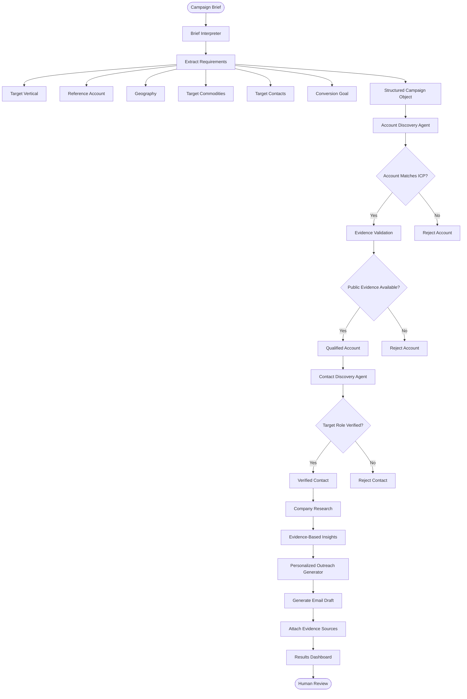

# FlytBase Outbound BDR Agent

AI-powered outbound BDR dashboard built for the **FlytBase Hiring Hackathon**.


## Workflow Architecture


## Tech Stack

- **Next.js 15** (App Router)
- **TypeScript**
- **Tailwind CSS v4**
- **Responsive UI**

## Getting Started

```bash
npm install
npm run dev
```

Open [http://localhost:3000](http://localhost:3000) in your browser.

## Project Structure

```
src/
├── app/
│   ├── api/
│   │   ├── health/route.ts      # Health check endpoint
│   │   └── workflow/route.ts    # Placeholder for AI workflow API
│   ├── globals.css
│   ├── layout.tsx               # Root layout with header/footer
│   └── page.tsx                 # Dashboard home page
├── components/
│   ├── dashboard/
│   │   ├── CampaignBrief.tsx    # Target vertical & reference company
│   │   ├── AIWorkflow.tsx       # 4-step workflow pipeline
│   │   ├── ResultsSection.tsx   # Results display area
│   │   └── DashboardHeader.tsx
│   ├── layout/
│   │   ├── Header.tsx
│   │   └── Footer.tsx
│   └── ui/                      # Reusable UI primitives
├── constants/
│   └── workflow.ts              # App constants & initial workflow steps
├── lib/
│   └── utils.ts                 # Utility helpers (cn)
└── types/
    └── index.ts                 # Shared TypeScript types
```

## Dashboard Sections

1. **Campaign Brief** — Target Vertical, Reference Company
2. **AI Workflow** — Account Identification, Contact Discovery, Company Research, Personalized Email Generator
3. **Results** — Placeholder panels for workflow output

## Next Steps

- Connect AI agents to `/api/workflow`
- Implement state management for workflow execution
- Populate Results section with live data
- Add loading/error states per workflow step

## Scripts

| Command       | Description              |
|---------------|--------------------------|
| `npm run dev` | Start development server |
| `npm run build` | Production build       |
| `npm run start` | Start production server |
| `npm run lint`  | Run ESLint             |
